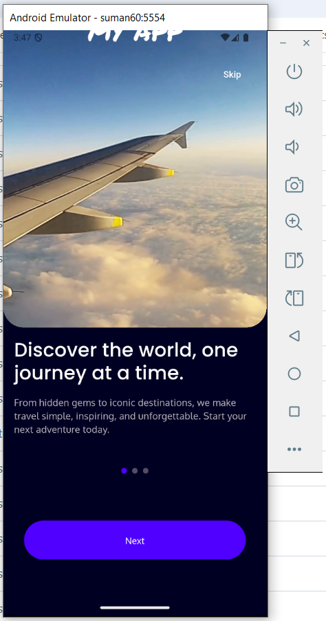
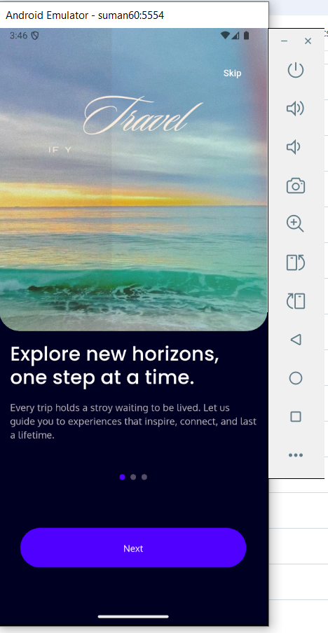
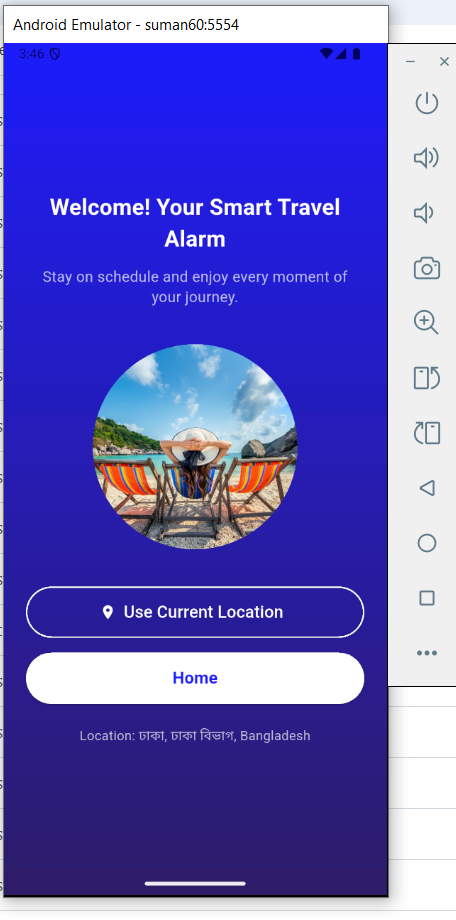
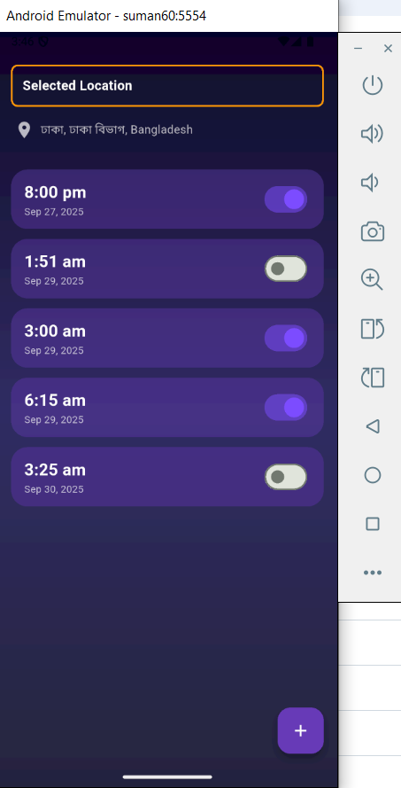

# 🌿 AlarmYourself 

A Flutter-based mobile application designed to set alarm more friendly. It consider the locactions where you have now for alarming.   

---

## 📦 Tools & Packages Used
- **Flutter** (cross-platform app development)
- **Dart** (programming language)
- **SQLite** (local database for storing app data)

---
## Screenshots

### Onboarding Screen 





### Location Access:


### Home Page

## ⚙️ Project Setup Instructions


1. Clone the repository:
   ```bash
   git clone https://github.com/suman60/AlarmYourself.git
